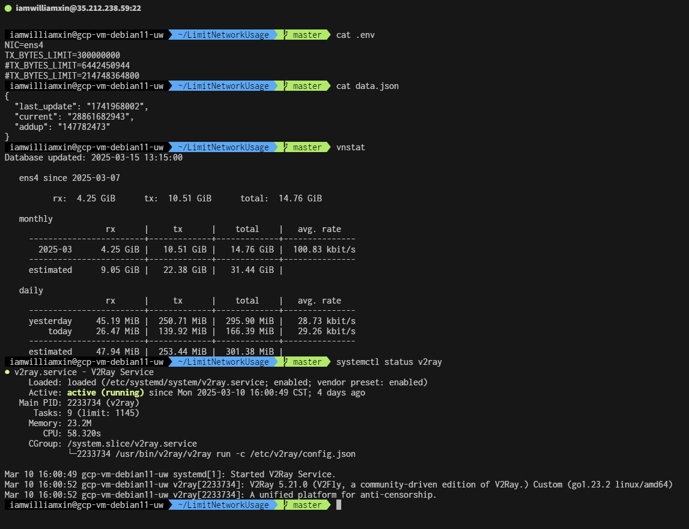
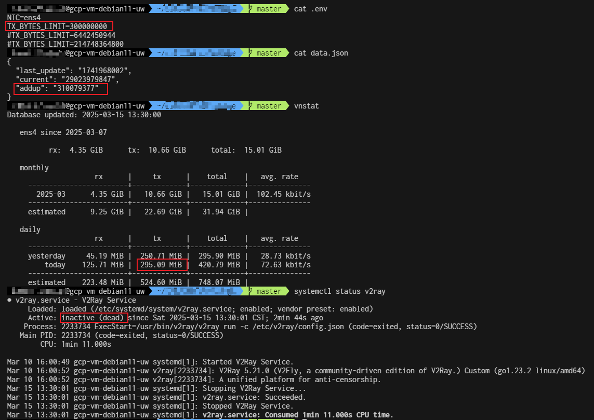

# CloudGuardian

CloudGuardian 是一个面向 Google Cloud 虚拟机的流量监控工具，帮助你把每月 200GB 的免费出站流量用满而不超支。

Google Cloud 的 e2-micro 免费套餐每月附带 200GB 出站流量，一旦超出，账单会立刻变得不可控。CloudGuardian 的做法很简单：定时统计虚拟机的实际出站流量，当接近你设定的阈值时，自动限制或暂停相关服务，把流量稳稳控制在免费额度以内。

#### 它做了什么：

- **按阈值自动控流**：持续统计出站流量，默认按每日 6GB（可自行调整）进行控制，避免月底流量爆表。
- **兼容常见服务**：可以对 nginx、v2ray、x-ui、sing-box 等服务生效。
- **部署很轻**：本质上是一个脚本加一条 crontab 定时任务，不需要安装额外的守护进程或后台软件。
- **逻辑透明**：所有判断都基于本机的流量统计，不上传数据、不依赖第三方服务。

#### 适合什么场景：

- 想长期用免费额度跑个人网站、博客或网盘，又不想被意外流量账单打扰。
- 需要部署测试环境或轻量应用，希望把云成本控制在免费额度内的开发者。

---

#### 效果展示：

以每天 0.25G 流量上限为例（这个数值可修改，**GCP 实际每天可使用 6G 上传流量，只要每月不超过 200G 即可**）展示一下效果：

##### 达到额度之前：



##### 达到额度之后：



---

#### 环境准备：

##### 请自备：

- Google 账户
- 信用卡，用于将 Google 账户升级到付费账户
- GCP VPS，每月 200GB 免费标准层，VPS 创建方法请自己搜索，这里不提供。

##### 谷歌云永久免费服务器限制要求：

- 地区限制：在美国的以下区域俄勒冈、爱荷华、南卡罗来纳；

- 磁盘限制：30 GB 标准永久性磁盘

- 网络服务层级：标准（每个区域每月可免费传输 200GB 数据）

---

#### 使用方法（以Debian11为例）：

```
cd ~
git clone https://github.com/yongxin-ms/CloudGuardian.git
cd CloudGuardian
cp .env.example .env

#为 .env文件中 TX_BYTES_LIMIT 设定阈值，缺省为6G每天，一般不用修改

sudo vim /etc/crontab

# Append the following line to crontab
* * * * * root cd /home/{YOUR_USER_NAME}/CloudGuardian/ && ./run.sh
```


已支持关闭和启动的服务包括：

- nginx
- v2ray
- x-ui
- sing-box


---

#### 如果这个工具帮到了您，是否可请我喝杯咖啡？金额随意，谢谢！

|  |  |
| -------------------------------------- | ------------------------------ |

---

**如果你觉得这个工具有用，麻烦请 Star，如果您有意见或者建议，欢迎提 Issue！**

您的支持是我坚持的动力，感谢！
