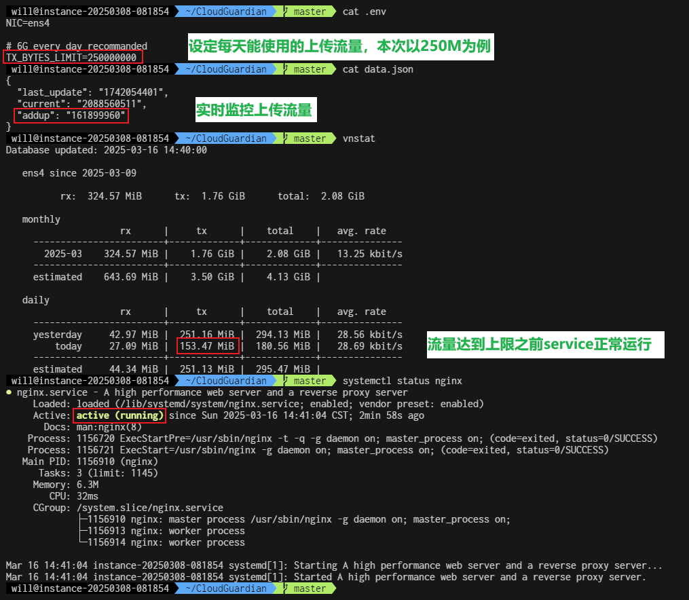
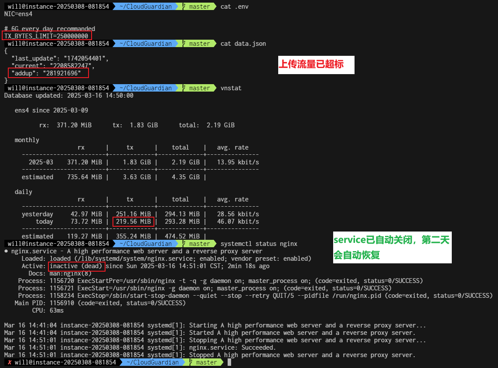

## 告别费用焦虑，畅享永久免费的 Google Cloud VPS！

还在为 Google Cloud 虚拟机一不小心产生的高昂的流量费用而烦恼吗？现在，这一切都将成为过去！

**Cloud-Guardian 助您轻松掌控 Google Cloud 虚拟机流量，将每月 200G 免费流量用到极致，彻底告别额外费用，放心使用，永久免费！**

**核心优势：**

- **精准流量控制：** 实时监控虚拟机流量使用情况，精确控制出站流量，确保始终在 200G 免费额度内，避免产生任何额外费用。
- **简单易用：** 无需复杂配置，只需简单几步即可完成设置，即使是新手用户也能轻松上手。
- **安全可靠：** 不安装额外软件，确保数据安全和隐私，让您使用无忧。

**适用场景：**

- **个人用户：** 搭建个人网站、博客、云盘等，享受高速稳定的网络环境，无需担心流量费用。
- **开发者：** 部署测试环境、开发应用，享受灵活的云计算资源，降低开发成本。

**您将获得：**

- **真正的永久免费：** 可以无需支付任何费用，即可享受 Google Cloud 的高性能 VPS。
- **更低的成本：** 告别高昂的流量费用，大幅降低云服务使用成本。
- **更自由的体验：** 无需担心流量超标，尽情享受云计算带来的便利。

**立即行动，开启您的永久免费 Google Cloud VPS 之旅！**

**Cloud-Guardian- 让云计算更简单，更经济！**

---

#### 效果展示：

以每天 0.25G 流量上限为例（这个数值可修改，**GCP 实际每天可使用 6G 上传流量，只要每月不超过 200G 即可**）展示一下效果：

##### 达到额度之前：



##### 达到额度之后：



---

#### 环境准备：

##### 请自备：

- Google 账户
- 信用卡，用于将 Google 账户升级到付费账户
- GCP VPS，每月 200GB 免费标准层，VPS 创建方法请自己搜索，这里不提供。

##### 谷歌云永久免费服务器限制要求：

- 地区限制：在美国的以下区域俄勒冈、爱荷华、南卡罗来纳；

- 磁盘限制：30 GB 标准永久性磁盘

- 网络服务层级：标准（每个区域每月可免费传输 200GB 数据）

---

#### 使用方法：

```
sudo apt remove -y --purge man-db
sudo apt install -y git

cd ~
git clone https://github.com/yongxin-ms/CloudGuardian.git
cd CloudGuardian
cp .env.example .env

sudo vim /etc/crontab

# Append the following line to crontab
* * * * * root cd /home/{YOUR_USER_NAME}/CloudGuardian/ && ./run.sh
```

---

#### 热心老板请我喝杯咖啡，请随意！

|  |  |
| -------------------------------------- | ------------------------------ |

---

**如果你觉得这个工具有用，麻烦请 Star，如果您有意见或者建议，欢迎提 Issue！**

您的支持是我坚持的动力，感谢！

## Star History

[](https://www.star-history.com/#yongxin-ms/CloudGuardian&Date)
